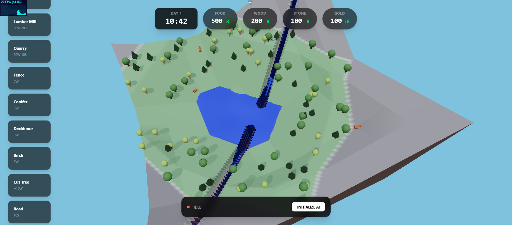
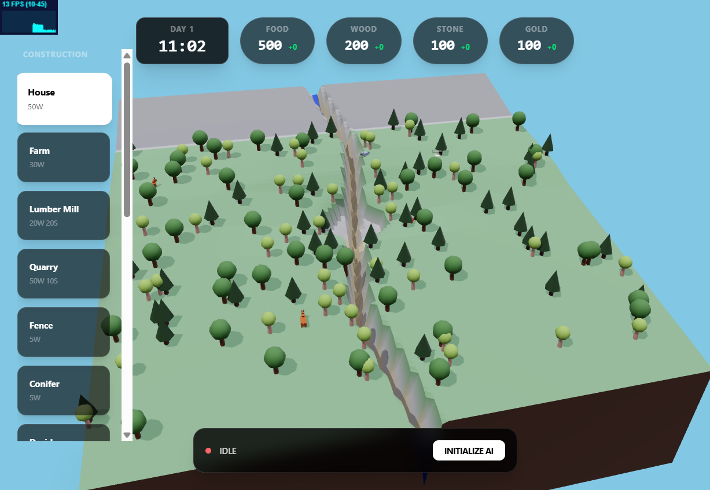

# Delta Dynamics

A low-poly terrain and water simulation built with React and Three.js.

## Features

- **Dynamic Terrain:** Real-time terrain modification and erosion.
- **Water Simulation:** GPU-accelerated water flow and ponding logic.
- **AI Integration:** Local LLM integration for game entity behavior.
- **Economy & Entities:** Resource management and instanced entity systems.

## Tech Stack

- **Framework:** React 19 + Vite
- **3D Engine:** Three.js + React Three Fiber
- **State Management:** Zustand
- **AI:** Web-LLM
- **Styling:** Tailwind CSS 4

## Getting Started

```bash
# Install dependencies
npm install

# Start development server
npm run dev
```

## Screenshots



