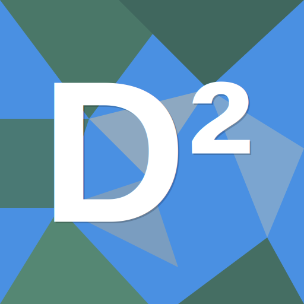
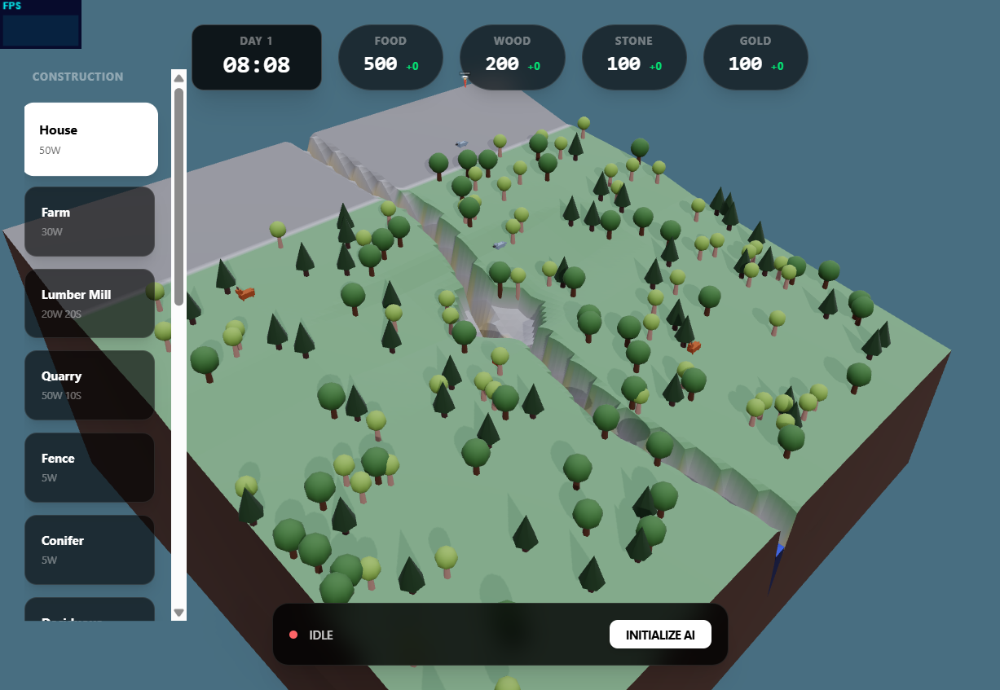
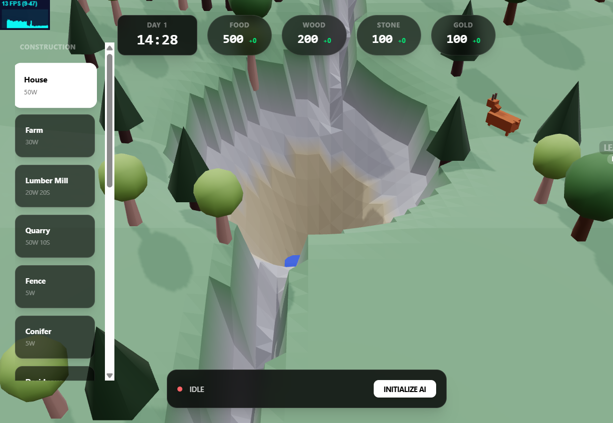
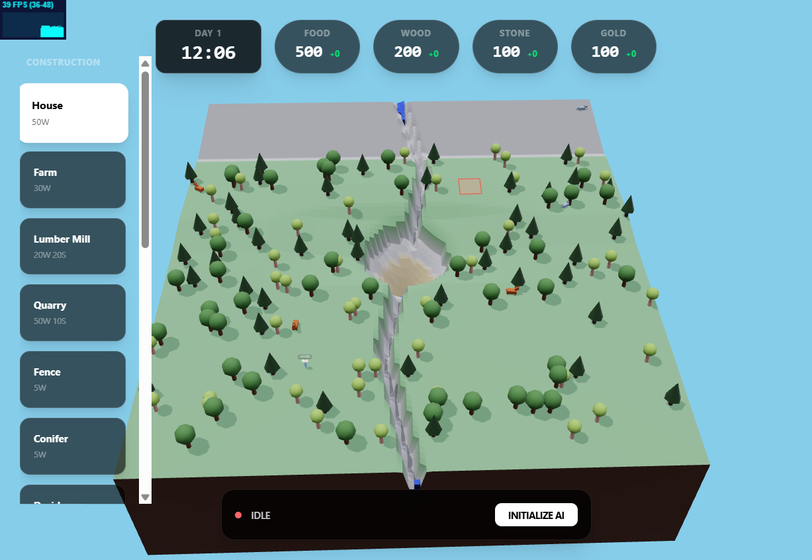

<p align="center">
  
</p>

<h1 align="center">Delta Dynamics</h1>

<p align="center">
  <strong>Ecosystem Simulator</strong> — A premium low-poly terrain and water simulation built with React and Three.js.
</p>

<p align="center">
  <a href="https://ghackenberg.github.io/delta-dynamics/"><strong>Play Live Demo »</strong></a>
</p>

---

## Features

- **Dynamic Terrain:** Real-time terrain modification, custom heights, and procedural generation.
- **GPU Water Simulation:** High-performance, GPU-accelerated water flow, lake ponding, and side-mesh rendering.
- **Local AI Integration:** Local LLM integration powered by Web-LLM for autonomous game entity behavior and advisor recommendations.
- **Economy & Entities:** Sophisticated resource management, day/night cycles, and instanced entity rendering systems.

## Tech Stack

- **Framework:** React 19 + React Router 7 + Vite 8
- **3D Graphics:** Vanilla Three.js (r184) with custom GLSL shaders (terrain, water, and instanced props)
- **State Management:** Zustand 5
- **AI Integration:** Web-LLM (0.2.83)
- **Styling:** Tailwind CSS 4

## Getting Started

Follow these steps to run the project locally:

```powershell
# Install dependencies
npm install

# Start the development server
npm run dev
```

The application will run locally at `http://localhost:5173/delta-dynamics/`.

## Screenshots

<p align="center">
  
  
</p>

<p align="center">
  
  
</p>
